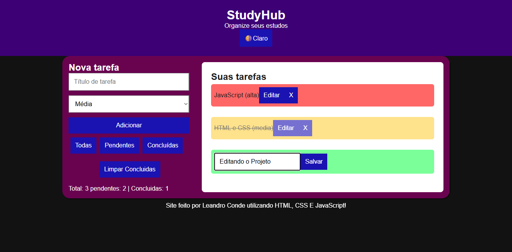

# StudyHub
StudyHub é um organizador de tarefas pra te ajudar a estudar sem perder o controle. Dá pra adicionar, editar e apagar tarefas, marcar o que já foi feito, filtrar por status, arrastar pra mudar a ordem e alternar entre modo claro e escuro. Cada tarefa ainda ganha uma cor de acordo com a prioridade. Tudo fica salvo no navegador, então você não perde nada quando fecha a página.

## 🔗 Acesso
Projeto disponível em:
- GitHub Pages: ([link do projeto](https://leandro-conde.github.io/StudyHub/))

## 📸 Preview

